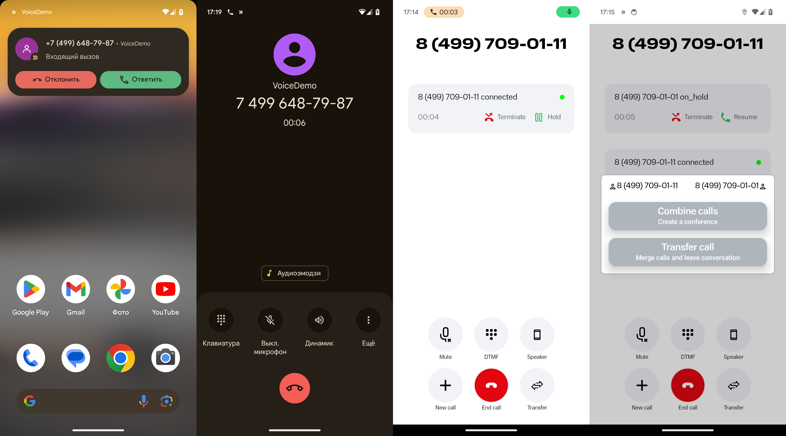

# Exolve Android Voice Demo
**Android Voice Demo** - это демонстрационное приложение, которое показывает, как интегрировать [Exolve Mobile Voice SDK](https://docs.exolve.ru/docs/ru/mobile-sdk) в ваш проект. С его помощью вы сможете реализовать исходящие и входящие вызовы в вашем мобильном приложении.



### Возможности Android Voice Demo:
- исходящий вызов;
- входящий вызов (с использованием Firebase или Huawei Messaging пуш уведомлений);
- постановка вызова на удержание и снятие с удержания;
- поддержка нескольких звонковых линий с возможностью переключения между ними;
- создание локальной конференции на устройстве;
- перевод вызова с сопровождением и без;
- интеграция Voice SDK с системным приложением для звонков через [Android TelecomManager](https://developer.android.com/reference/android/telecom/TelecomManager).

### Подключение Voice SDK в существующий проект Android Studio

1. Необходимо прописать maven репозиторий Voice SDK в [settings.gradle](settings.gradle) проекта с указанием [вашего пользователя и токена на GitHub](https://docs.github.com/en/packages/working-with-a-github-packages-registry/working-with-the-gradle-registry#using-a-published-package): 
    ```
    maven {
        url = uri("https://maven.pkg.github.com/mtsexolve/mobile-voice-sdk")
        credentials {
            username = project.findProperty("gpr.user") ?: System.getenv("USERNAME")
            password = project.findProperty("gpr.key") ?: System.getenv("TOKEN")
        }
    }
    ```

2. Подключить VoiceSDK в [build.gradle](./app/build.gradle) в разделе dependencies:
    ```
    dependencies {
        implementation 'com.exolve:voicesdk:1.+'
        ...
    }
    ```

### Готовая сборка Android Voice Demo
Доступны 2 сборки приложения:
- с поддержкой Firebase пуш нотификаций;
- с поддержкой Huawei Messaging пуш нотификаций.

Последние сборки доступны по [ссылке](https://github.com/mtsexolve/android-voice-demo/releases). Для настройки поступления в них входящих вызовов с использованием пуш уведомлений (Firebase или Huawei Messaging) необходимо обратится в службу технической поддержки МТС Exolve.

### Сборка Android Voice Demo 
Сделайте клон этого репозитория и откройте его в Android Studio.
В файле [local.properties](./local.properties) укажите значения переменных:
- GH_USERNAME - имя пользователя GitHub;
- GH_TOKEN - GitHub токен.

Соберите проект и запустите его на устройстве или эмуляторе.

### Подготовка Android Voice Demo к работе
Для того чтобы начать совершать звонки требуется настроенная SIP учетная запись на портале [МТС Exolve](https://dev.exolve.ru). Более детальная инструкция по настройке доступна по [ссылке](https://community.exolve.ru/faq/kak-podklyuchit-sip-mts-exolve).
